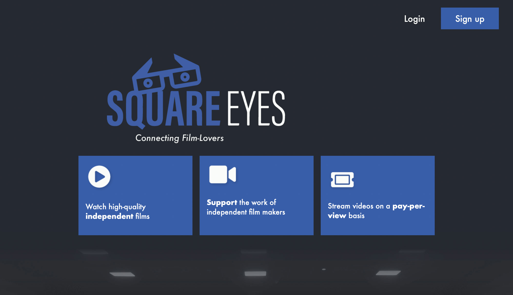

# Square Eyes

This is my first web project ever! I was tasked with designing a streaming platform for two target audiences: (a) independent film makers and (b) lovers of independent films. It has been developed as part of the HTML, CSS, Javascript 1, Content Management Systems, Design and Interaction Design modules of my front-end development study programme.

## Description

The development of this project consisted of the following steps:

- Designing wireframes and prototypes;
- Understanding concepts of design, typography and colour theory;
- Developing a responsive website;
- Creating a headless WordPress installation to manage the website's content;
- Making API calls to the WordPress REST API to fetch the data;
- Installing Hotjar;
- Performing usability tests to improve user experience.

## Built with

- Adobe XD
- HTML
- CSS
- Javascript
- Wordpress REST API
- Hotjar

## Links

- PRODUCT | [Link to the website deployed via Netlify](https://flamboyant-kepler-31f987.netlify.app/index.html)
- [Mid-fidelity web prototype](https://xd.adobe.com/view/b9dfe27d-9705-4288-8e0a-04802ff3849d-ec8c/)
- [Low-fidelity mobile prototype](https://xd.adobe.com/view/de1c8982-7250-447a-b29c-4a72defd56ff-8b4f/)
- [Design: report](https://shared-assets.adobe.com/link/0b4ad6f6-64fa-460b-4458-ea1e81943740)
- [Interaction Design: report](https://shared-assets.adobe.com/link/0f31874a-4d47-44f8-6693-13c8b2b2c257)

## Grade & Feedback from instructor

**Grade:** 10 / 10

**Grading criteria**

- User-Experience: Can apply knowledge of the central concepts and processes for visual designing user-friendly solutions and services for web and mobile devices (3points);
- Technical proficiency: Masters Adobe XD and can perform simple image editing, designing or editing identity elements for on-screen use (3 points);
- UI: Typography, colour palette and layout component choices: Can apply basic knowledge about identity elements such as typography, color and graphic elements and perform simple development or editing of visual elements for on-screen use (3 points);
- Report: Includes a thorough report (1 point).

_Feedback from instructor: The site has a very nice use of colour, and it’s easy to understand overall. The user experience is smooth, easy to navigate and master, with great user feedback & guidance. Keep consistency in mind for your site; the sizing & placing of the pages, text and elements across the website should be the same across the pages. Your mobile version works really well!_

## Contributing

Feel free to suggest improvements and open a pull request if you want to get involved in this project.

## License

- Copyright (c) 2022 Henri Kugler
- [MIT License](/LICENSE)

## Contact

- [My LinkedIn page](https://www.linkedin.com/in/henri-kugler-78218422b/)
- [My personal portfolio](https://nehguk.github.io)

## Acknowledgments

This project uses royalty-free images from [Unsplash](https://unsplash.com).
